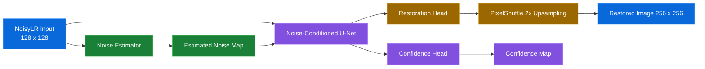

<div align="center">

# KLA Image Restoration & Super-Resolution

### Noise-Aware Deep Learning for Semiconductor Image Enhancement

**Team Name: NanoSight**

**Arshiya Agarwal | Minal Pramod Borkar | Srujan Pratap Powar | Aadya Priyadarshi**

KLA 2026 — PS01

</div>

---

## Demo Video

[Watch the NanoSight Demo Video](https://drive.google.com/file/d/139ZxGLpOCH66nSlQtybnwkKg9aFqUq9_/view?usp=sharing)

## Overview

This project presents a lightweight deep-learning pipeline for restoring degraded semiconductor images.

The model performs two tasks jointly:

- **Noise suppression**
- **2× image super-resolution**

The network converts a degraded **128×128 NoisyLR image** into a restored **256×256 image** while preserving structural information.

---

## Model Architecture

The proposed system combines noise estimation, noise-conditioned image restoration, super-resolution, and confidence prediction in a single pipeline.



### Architecture Components

| Component | Function |
|---|---|
| **Noise Estimator** | Estimates degradation characteristics from the NoisyLR input |
| **Noise-Conditioned U-Net** | Performs feature extraction and reconstruction conditioned on estimated noise |
| **Restoration Head** | Generates features required for image reconstruction |
| **PixelShuffle** | Performs learned 2× spatial upscaling |
| **Confidence Head** | Produces an auxiliary confidence map for the restored prediction |

The architecture performs denoising and super-resolution jointly while maintaining a relatively small parameter count.

---

## Problem Statement

Semiconductor images may contain multiple simultaneous degradations that affect accurate inspection and analysis.

The project addresses:

| Degradation | Effect | Restoration Objective |
|---|---|---|
| **Speckle Noise** | Grainy pixel-level distortion | Suppress noise while retaining structural information |
| **Gaussian Noise** | Reduced edge clarity and fine detail | Recover image structure and contrast |
| **Resolution Reduction** | Loss of spatial information | Reconstruct a high-resolution image |

Instead of treating denoising and super-resolution as separate sequential tasks, the proposed model learns a **joint restoration mapping**.

---

## Key Features

### Noise-Aware Restoration

A dedicated noise estimator extracts degradation information from the input. This information conditions the restoration network and allows it to adapt to variations in image degradation.

### Joint Denoising and Super-Resolution

The network performs noise removal and **2× spatial reconstruction within a single model**.

### Lightweight Architecture

The trained model contains approximately:

> **2.77 million parameters**

This keeps the network computationally efficient while maintaining restoration capability.

### Confidence Prediction

An auxiliary confidence head produces a confidence map alongside the reconstructed image.

### Composite Training Objective

Multiple complementary loss functions are combined to optimize pixel accuracy, structural similarity, high-frequency reconstruction, and confidence estimation.

---

## Training Objective

The model is optimized using a combination of:

```text
Charbonnier Loss
        +
SSIM Loss
        +
Frequency Loss
        +
Confidence Regularization
```

| Loss Component | Purpose |
|---|---|
| **Charbonnier Loss** | Robust pixel-level reconstruction |
| **SSIM Loss** | Structural preservation |
| **Frequency Loss** | Recovery of fine details and high-frequency information |
| **Confidence Regularization** | Regularization of the auxiliary confidence prediction |

---

## Dataset

The provided training dataset contains **3,200 paired grayscale samples**.

| Dataset Component | Resolution | Description |
|---|---:|---|
| **NoisyLR** | 128 × 128 | Degraded low-resolution input |
| **Ground Truth (GT)** | 256 × 256 | Clean high-resolution target |

Dataset structure:

```text
train/
│
├── GT/
│   ├── 000000.npy
│   ├── 000001.npy
│   ├── 000002.npy
│   └── ...
│
└── NoisyLR/
    ├── 000000.npy
    ├── 000001.npy
    ├── 000002.npy
    └── ...
```

The degraded inputs may contain intensity values outside the ground-truth `[0,1]` range as a result of the degradation process.

---

## Experimental Results

The model was trained for **10 epochs** and evaluated on a held-out validation set containing **320 paired images**.

| Metric | Validation Result | Interpretation |
|---|---:|---|
| **PSNR** | **27.01 dB** | Higher is better |
| **SSIM** | **0.7212** | Higher is better |
| **LPIPS** | **0.3119** | Lower is better |
| **Validation Samples** | **320** | Held-out evaluation set |

These metrics evaluate complementary aspects of restoration quality:

- **PSNR** measures reconstruction fidelity.
- **SSIM** measures structural similarity.
- **LPIPS** measures perceptual similarity.

---

## Qualitative Restoration Result


**Degraded NoisyLR → Restored Output → Ground Truth**

For the displayed example:

| Metric | Result |
|---|---:|
| **PSNR** | **31.74 dB** |
| **SSIM** | **0.939** |

The qualitative comparison demonstrates substantial suppression of input degradation while reconstructing the image from **128×128 to 256×256 resolution**.

---

## Inference Performance

Inference performance was measured on an **NVIDIA Tesla T4 GPU** after GPU warm-up.

| Performance Metric | Measured Result |
|---|---:|
| **Mean Inference Time** | **9.33 ms/image** |
| **Median Inference Time** | **6.89 ms/image** |
| **Throughput** | **107.13 FPS** |
| **Model Parameters** | **~2.77M** |

> Inference measurements reported above were obtained on an NVIDIA Tesla T4 and do not represent the official KLA H100 benchmark.

---

## Technology Stack

| Component | Technology |
|---|---|
| **Deep Learning Framework** | PyTorch |
| **Programming Language** | Python |
| **Training Platform** | Google Colab |
| **Training GPU** | NVIDIA Tesla T4 |
| **Image Processing** | NumPy / scikit-image |
| **Perceptual Evaluation** | LPIPS |
| **Architecture** | Noise-Conditioned U-Net + PixelShuffle |

---

## Repository Structure

```text
Nanosight_KLA_PS01/
│
├── models/
│   └── kla_best_model.pt
│
├── src/
│   ├── train.py
│   ├── evaluate.py
│   ├── model.py
│   ├── losses.py
│   ├── noise_estimator.py
│   ├── degrade.py
│   └── make_demo_figure.py
│
├── outputs/
│   └── KLA_real_restoration.png
│
├── kla_best_model.pt
├── run.py
├── requirements.txt
└── README.md
```

---

## Training

### 1. Install Dependencies

```bash
pip install -r requirements.txt
```

### 2. Prepare Dataset

Organize the paired training data as:

```text
train/
├── GT/
└── NoisyLR/
```

The filenames in `GT` and `NoisyLR` should correspond to one another.

### 3. Train Model

```bash
python src/train.py \
    --data_dir /path/to/train \
    --model_size small \
    --epochs 10 \
    --batch_size 4 \
    --lr 0.0001 \
    --output kla_best_model.pt
```

The trained weights are stored as:

```text
kla_best_model.pt
```

---

## Evaluation / Inference

The submission provides a standalone evaluation entry point compatible with the KLA benchmark requirements.

Run:

```bash
python run.py <input-dir> <output-dir>
```

The input directory should contain `.npy` degraded grayscale images.

For each input file, the script:

- loads the `.npy` input
- runs inference using the trained model
- produces a restored `.npy` output
- preserves the input filename
- creates the output directory if required

Example:

```bash
python run.py test_input test_output
```

Input:

```text
test_input/
├── 000001.npy
└── 000002.npy
```

Output:

```text
test_output/
├── 000001.npy
└── 000002.npy
```

The restored outputs are grayscale arrays with the target resolution and values constrained to the range `[0, 1]`.

---

## Experimental Configuration

| Parameter | Configuration |
|---|---|
| **Available Paired Samples** | 3,200 |
| **Validation Samples** | 320 |
| **Training Epochs** | 10 |
| **Input Resolution** | 128 × 128 |
| **Output Resolution** | 256 × 256 |
| **Upscaling Factor** | 2× |
| **Model Parameters** | ~2.77M |
| **Training GPU** | NVIDIA Tesla T4 |
| **Framework** | PyTorch |

---

## Design Objectives

### 1. Restoration Quality

Suppress image degradation while preserving semiconductor structures and boundaries.

### 2. Super-Resolution

Reconstruct a **256×256 high-resolution image** from a **128×128 degraded input**.

### 3. Noise Adaptation

Condition the restoration process on estimated degradation information rather than applying identical processing to every input.

### 4. Computational Efficiency

Maintain a lightweight architecture with approximately **2.77M parameters** and fast GPU inference.

### 5. Reliability Estimation

Generate an auxiliary confidence map alongside the restored image.

---

## Summary

The proposed pipeline integrates:

**Noise Estimation → Noise-Conditioned Restoration → 2× Super-Resolution → Confidence Prediction**

The trained model achieved:

| Result | Value |
|---|---:|
| **Validation PSNR** | **27.01 dB** |
| **Validation SSIM** | **0.7212** |
| **Validation LPIPS** | **0.3119** |
| **Mean Inference Time** | **9.33 ms/image** |
| **Throughput** | **107.13 FPS** |
| **Model Size** | **~2.77M parameters** |

---

<div align="center">

### KLA Image Restoration & Super-Resolution

**KLA 2026 — PS01**

**Team: NanoSight**

**Arshiya Agarwal | Minal Pramod Borkar | Srujan Pratap Powar | Aadya Priyadarshi**

</div>
